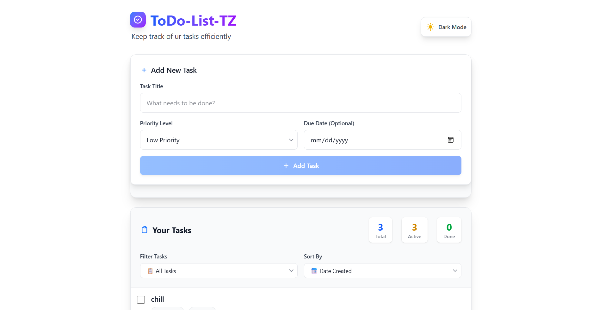
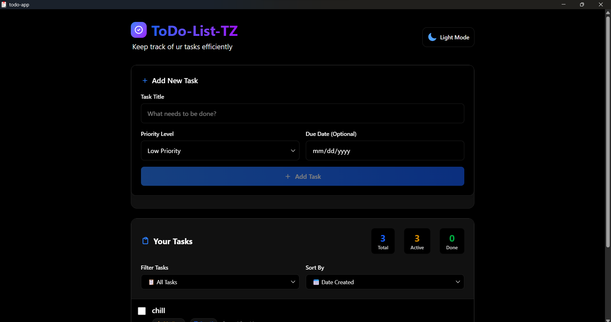
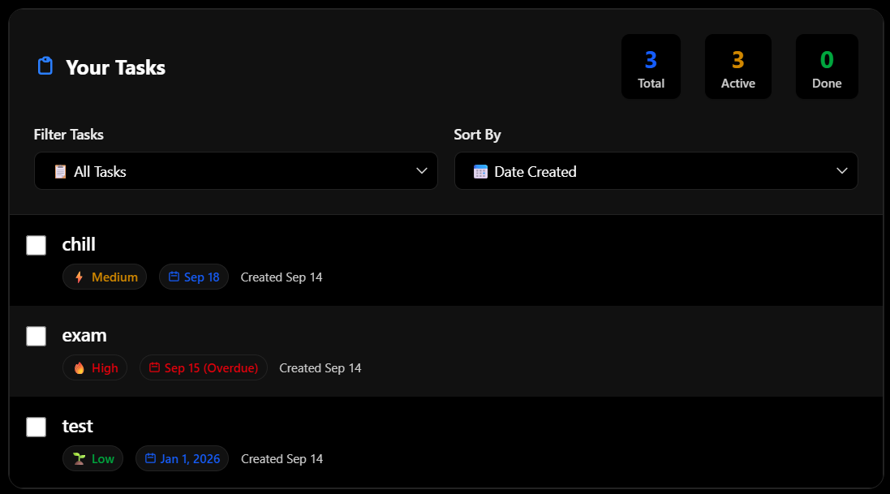

# � Wails TODO Desktop Application

A modern, cross-platform desktop TODO app built with **Go** (backend) and **React + Tailwind CSS** (frontend) using the [Wails](https://wails.io/) framework. Tasks are persisted locally using a JSON file. This app demonstrates clean architecture, desktop integration, and a minimalistic black/white UI theme.

---

## Features

- Add, edit, complete, and delete tasks
- Task priorities (Low, Medium, High)
- Due dates and overdue highlighting
- Filter and sort tasks (All, Active, Completed, by date, priority, due date)
- Persistent storage (local JSON file)
- Responsive, minimalistic UI (pure black/white theme)
- Light/Dark theme toggle
- Task statistics (total, active, completed)

---

## Technology Stack

- **Backend:** Go (clean architecture, Wails bindings)
- **Frontend:** React 18, Vite
- **Styling:** Tailwind CSS 4, custom CSS variables
- **Desktop Framework:** Wails v2
- **Persistence:** Local JSON file

---

## Project Structure

```
backend/
├── models/         # Task data structures
├── repository/     # JSON file persistence
└── services/       # Business logic (CRUD, filtering, sorting)

frontend/
├── src/
│   ├── components/ # React components (TaskInput, TaskList, etc.)
│   ├── App.jsx     # Main app
│   └── style.css   # Tailwind and theme overrides
└── index.html      # App entry point
```

---

## Getting Started

### Prerequisites

- [Go 1.20+](https://golang.org/dl/)
- [Node.js 18+](https://nodejs.org/)
- [Wails CLI](https://wails.io/docs/gettingstarted/installation)

### Setup & Run

1. **Clone the repository**
   ```powershell
   git clone https://github.com/SuWh1/TestTaskToDoList.git
   cd TestTaskToDoList/todo-app
   ```

2. **Install dependencies**
   ```powershell
   # Backend (Go)
   wails doctor

   # Frontend (Node.js)
   npm install
   ```

3. **Run the application**
   ```powershell
   wails dev
   ```

   The app will launch as a desktop window.

---

## Build for Distribution

```powershell
wails build
```

The output executable will be in the `build/bin` directory.

---

## Usage

1. **Add a task:** Enter a title, set priority/due date, click "Add Task".
2. **Complete a task:** Click the checkbox.
3. **Delete a task:** Click the delete button (confirmation shown).
4. **Filter/sort:** Use filter/sort controls above the task list.
5. **Theme toggle:** Switch between light and dark modes.

---

## Data Storage

All tasks are stored locally in a JSON file managed by the Go backend. No external database required.

---

## Troubleshooting

- **Wails CLI not found?** Install via `go install github.com/wailsapp/wails/v2/cmd/wails@latest`
- **Build errors?** Run `wails doctor` and check Go/Node versions.
- **UI not updating?** Restart the app and ensure frontend dependencies are installed.

---

## Preview



